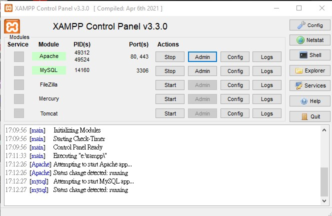
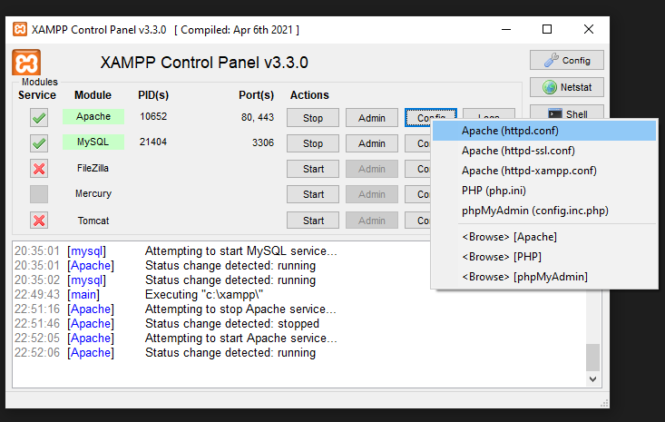
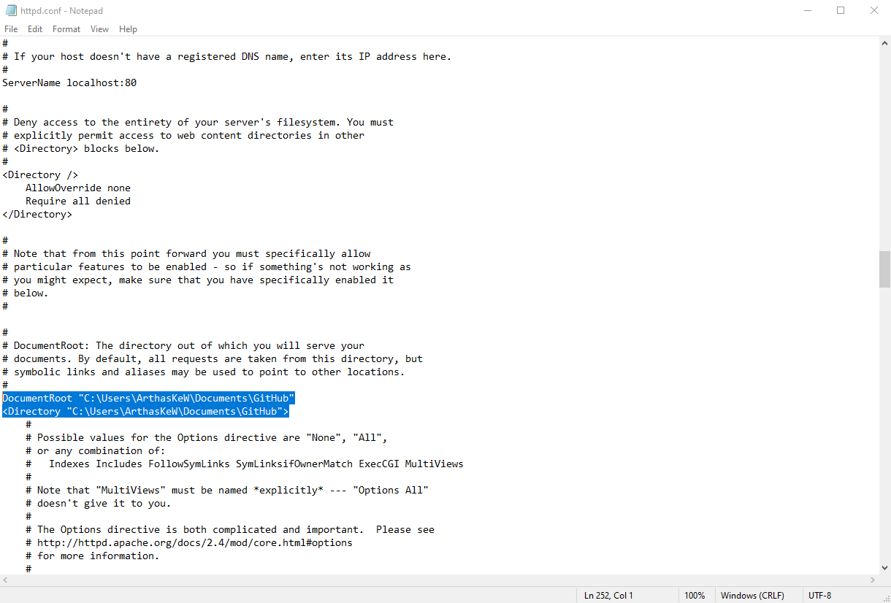

# COMP3421-WebProject

A eCommerce project developed using HTML CSS and PHP

## Installation
1. Install XAMPP on your system [DOWNLOAD](https://www.apachefriends.org/download.html)

2. Go to the xampp directory

```
.../xampp/htdocs/
```

3. Clone the project
```
git clone https://github.com/Ualnomis/COMP3421-WebProject.git
```
 
4. Open the xampp and start the Apache and MySQL like this



5. Change the project path if necessary




6. Go to `sql` folder and Copy the SQL in `giftify.sql`
```
.../sql/giftify.sql
```

7. Go to [http://localhost/phpmyadmin/](http://localhost/phpmyadmin/)
8. Click SQL tab > paste the sql > run
9. Go to [http://localhost/COMP3421-WebProject/public/](http://localhost/COMP3421-WebProject/public/) to check the project

admin (seller) accounts:
```
email:admin@giftify.com
password:admin
```

buyer account:
use registration page


DEMO: https://youtu.be/-Rx0fUhu9dI